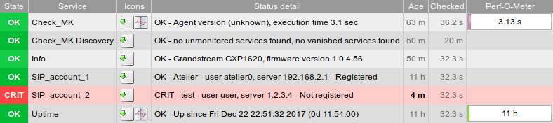

# check_mk-misc

Miscellaneous Check_MK plugins.

## agent_grandstream

Agent to check Grandstream IP phones.

### Notes
* As of now, this is only tested with a Grandstream GXP1620.
* Considering that some "magic" parameter names like `P402` are used to query the required information, this might not work out of the box for other phones.
* Running the agent logs out any user currently using the web interface of the phone.
* Directly after boot, uptime is available in minutes. Later, it is only available in daily granularity.

### Usage
* copy the check to `~/local/share/check_mk/agents/special/agent_grandstream`
* add a rule "Individual program call instead of agent access" with the command `~/local/share/check_mk/agents/special/agent_grandstream $HOSTADDRESS$ --user user --password $your-user-password`

## agent_levelone_wap0006

Agent to check the uptime of LevelOne Wireless Access Point WAP 0006
(this is the only relevant information exposed by the web interface).

### Usage
* copy the check to `~/local/share/check_mk/agents/special/agent_levelone_wap0006`
* add a rule "Individual program call instead of agent access" with the command `~/local/share/check_mk/agents/special/agent_levelone_wap0006 $HOSTADDRESS$ --user admin --password $your-admin-password`

## telegram

Notification plugin for telegram

### Usage

* copy `telegram` to `~/local/share/check_mk/notifications/`
* copy `notifications_telegram.py` to `~/local/share/check_mk/web/plugins/wato/`
* Select the notification method 'Notify via telegram' from the dropdown
* Fill token & chat id (see the [Telegram Documentation](https://core.telegram.org/bots) for how to create a bot and obtain the token)
